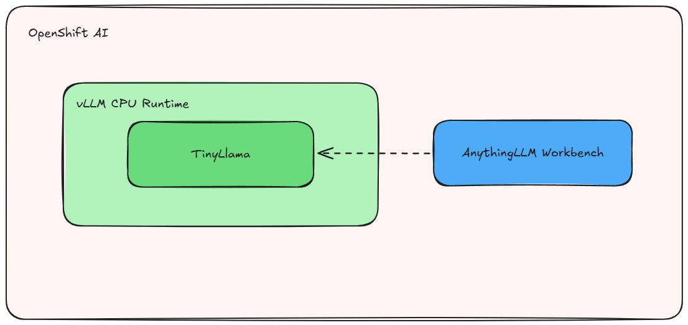

# ELIGIBILITY ASSESSMENT MCP LLAMASTACK

Welcome to the Eligibility Assessment System powered by LlamaStack and Model Context Protocol (MCP)!
This system helps assess eligibility for Family Care Unpaid Leave Support based on the Republic of Aragonia's Act No. 2025/47-SA.
To get started quickly, jump straight to [installation](#install).

## Detailed description 

The Eligibility Assessment MCP LlamaStack system is an intelligent solution for evaluating eligibility for Family Care Unpaid Leave Support based on the Republic of Aragonia's legislation (Act No. 2025/47-SA and related regulations). The system combines the power of LlamaStack with Model Context Protocol (MCP) servers and Retrieval Augmented Generation (RAG) to provide accurate, context-aware assessments.

This system is designed to help users understand their eligibility for unpaid leave assistance in various family care situations, including care for sick/injured family members, childcare for multiple children, adoption cases, and single-parent family scenarios.

This deployment includes a Helm chart for setting up:

- An OpenShift AI Project with all necessary components
- LlamaStack distribution with Llama 3.1 8B model for natural language processing  
- MCP server for the eligibility engine with specialized knowledge processing
- Vector database (Milvus) with embedded legal documents for RAG capabilities
- Document loader service to populate the knowledge base with Act No. 2025/47-SA and regulations
- LlamaStack Playground interface for interactive eligibility consultations

Use this project to quickly deploy an intelligent eligibility assessment system that provides accurate, legally-informed guidance on Family Care Unpaid Leave Support eligibility. 🏛️

### See it in action

Experience the Eligibility Assessment System through the LlamaStack Playground interface. After deployment, you can interact with the system to:
- Ask questions about eligibility requirements for different family care scenarios
- Get detailed assessments based on the legal framework of Act No. 2025/47-SA
- Understand the documentation needed for applications
- Learn about financial assistance amounts and duration limits


### Architecture diagrams



### References 

- [LlamaStack Distribution](https://llama-stack.readthedocs.io/en/latest/) - The foundational platform for LLM applications
- [Model Context Protocol (MCP)](https://spec.modelcontextprotocol.io/) - Protocol for integrating context sources with language models  
- [Eligibility Engine MCP Server](https://github.com/alpha-hack-program/elegibility-engine-mcp-rs) - Rust-based MCP server for eligibility processing
- LlamaStack Docker images: [quay.io/opendatahub/llama-stack:odh](https://quay.io/opendatahub/llama-stack:odh)
- Model images from Red Hat AI Services ModelCar Catalog
- Based on Republic of Aragonia's Act No. 2025/47-SA: Family Care Unpaid Leave Support Act

## Requirements 

### Recommended hardware requirements 

- **GPU**: 1x NVIDIA A10G or equivalent (for optimal LLM performance)
- **CPU**: 8 cores 
- **Memory**: 24 Gi (to handle LlamaStack, MCP servers, and vector database)
- **Storage**: 20Gi (for models, vector database, and document storage)

Note: The system uses quantized Llama 3.1 8B model (w4a16) for efficient GPU utilization while maintaining good performance.

### Minimum hardware requirements 

- **GPU**: 1x NVIDIA A10G-SHARED (shared GPU allocation)
- **CPU**: 6 cores 
- **Memory**: 16 Gi 
- **Storage**: 10Gi 

### Required software  

- Red Hat OpenShift 4.16+ 
- Red Hat OpenShift AI 2.16+ 
- Dependencies for [Single-model server](https://docs.redhat.com/en/documentation/red_hat_openshift_ai_self-managed/2.16/html/installing_and_uninstalling_openshift_ai_self-managed/installing-the-single-model-serving-platform_component-install#configuring-automated-installation-of-kserve_component-install):
    - Red Hat OpenShift Service Mesh
    - Red Hat OpenShift Serverless
- **LlamaStack Components**:
    - LlamaStack Distribution with vLLM runtime
    - Model Context Protocol (MCP) server support
    - Vector database capabilities (Milvus)
- **Container Images**:
    - LlamaStack: `quay.io/opendatahub/llama-stack:odh`
    - vLLM Runtime: `quay.io/modh/vllm:rhoai-2.23-cuda`
    - Eligibility Engine MCP: `quay.io/atarazana/elegibility-engine-mcp-rs:latest`

### Required permissions

- Standard user. No elevated cluster permissions required 

## Install

**Please note before you start**

This system was tested on Red Hat OpenShift 4.16.24 & Red Hat OpenShift AI v2.16.2.  
Ensure you have access to GPU resources and the required container registries.

### Clone

```bash
git clone https://github.com/alpha-hack-program/elegibility-mcp-llamastack.git && \
    cd elegibility-mcp-llamastack/
```


### Create the project

```bash
PROJECT="elegibility-mcp-llamastack"

oc new-project ${PROJECT}
``` 

Label project with
- modelmesh-enabled: 'false'
- opendatahub.io/dashboard: 'true'

```bash
oc label namespace ${PROJECT} modelmesh-enabled=false opendatahub.io/dashboard=true
```

### Install with Helm

```
helm install elegibility-mcp-llamastack helm/ --namespace ${PROJECT} 
```

### Wait for pods

```bash
oc -n ${PROJECT} get pods -w
```

Expected pods (may take 5-10 minutes to start):
```
(Output)
NAME                                              READY   STATUS    RESTARTS   AGE
elegibility-lsd-0                                1/1     Running   0          8m
elegibility-lsd-playground-0                     1/1     Running   0          8m
elegibility-engine-0                             1/1     Running   0          7m
loader-0                                         0/1     Completed 0          6m
llama-3-1-8b-w4a16-predictor-df76b56d6-fw8fp    2/2     Running   0          10m
```

### Test

You can access the system in multiple ways:

#### Option 1: OpenShift AI Dashboard
Get the OpenShift AI Dashboard URL:
```bash
oc get routes rhods-dashboard -n redhat-ods-applications
```

Navigate to Data Science Projects -> elegibility-mcp-llamastack. You'll see the deployed models and workbenches.

#### Option 2: Direct Access to LlamaStack Playground
Get the LlamaStack Playground URL:
```bash
oc get routes elegibility-lsd-playground -n ${PROJECT}
```

Access the playground directly to interact with the eligibility assessment system.

#### Option 3: API Access
For programmatic access, get the LlamaStack API endpoint:
```bash
oc get routes elegibility-lsd -n ${PROJECT}
```

Use this endpoint to integrate the eligibility assessment capabilities into your applications.

## Example queries

- My mother had an accident and she's at the hospital, I have to take care of her, can I get access to the unpaid leave aid?
- My mother had an accident and she's at the hospital, I have to take care of her, tell me if I can get access to the unpaid leave aid and the requirements I have to meet.
- I have just adopted two children, at the same time, aged 3 and 5, am I elegible for the unpaid leave aid? How much?
- I have just adopted two children, at the same time, aged 3 and 5, tell me if I'm elegible for the unpaid leave aid and which requirements I should meet.
- I'm a single mom and I just had a baby, may I get access to the unpaid leave aid?

## Uninstall
```bash
helm uninstall elegibility-mcp-llamastack --namespace ${PROJECT}
```

To also remove the project:
```bash
oc delete project ${PROJECT}
```
